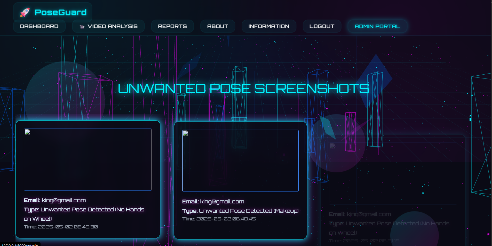
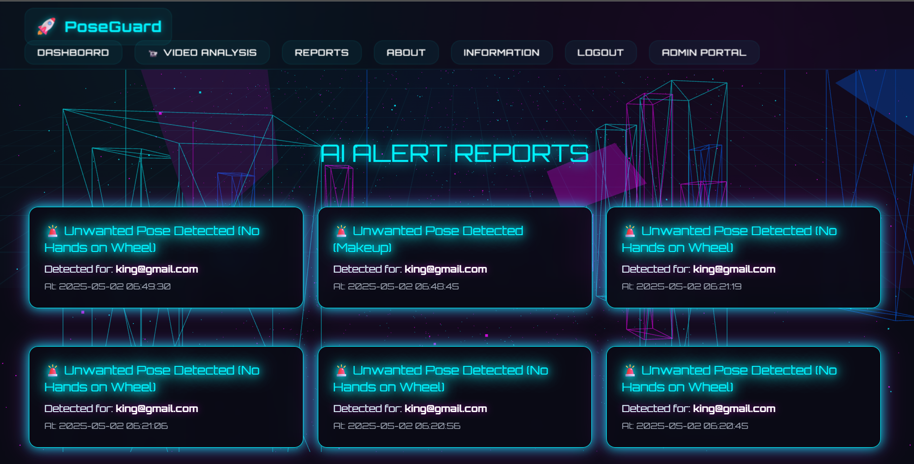
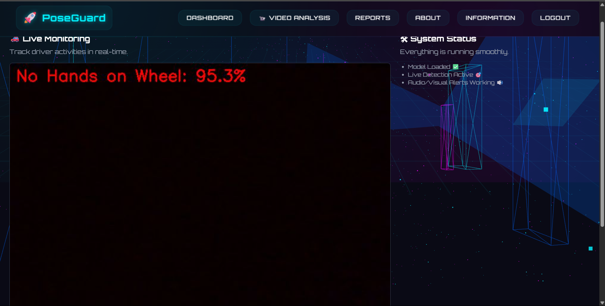

# 🚗 PoseGuard – Driver Unwanted Pose Detection and Feedback System

PoseGuard is a real-time AI-powered driver monitoring system that detects distracted or unsafe driver postures using computer vision and deep learning. It generates instant audio-visual alerts, captures incident screenshots, and logs them for admin review through a secure, role-based web portal.

---

## 📌 Features

- 🎯 Real-time driver pose detection using a trained CNN model.
- 🔊 Automated visual and audio alerts on detecting unsafe behavior.
- 🖼️ Incident screenshots saved with timestamps for review.
- 🧑‍💼 Role-based access with separate user and admin portals.
- 📊 Admin dashboard to view reports and monitoring insights.
- 🌐 Responsive frontend built with Tailwind CSS and Flask.
- 🔒 Secure authentication using hashed passwords.

---

## 🛠️ Tech Stack

| Layer           | Technologies                        |
|----------------|--------------------------------------|
| Frontend        | HTML, Tailwind CSS, Jinja2          |
| Backend         | Flask, Python                       |
| AI/Model        | TensorFlow / Keras (CNN-based)      |
| Database        | SQLite (via SQLAlchemy)             |
| Utilities       | OpenCV, playsound, bcrypt           |

---

## 🧠 Problem Statement

According to the **WHO**, distracted and drowsy driving causes nearly **25% of all road accidents**, resulting in over **1.3 million deaths per year**. PoseGuard aims to tackle this by offering a low-cost, real-time alerting system for transport and fleet operators to improve safety and accountability.

---

## 🚀 How It Works

1. The user logs into the system using secure credentials.
2. Upon login, the camera feed starts and the AI model begins analyzing poses.
3. If an unwanted pose (e.g., drowsiness, mobile use) is detected:
   - ⚠️ A warning sound is played.
   - 🖼️ A screenshot is saved with a timestamp.
   - 🗂️ The event is logged in the database.
4. Admins can log in to view all incidents in the **admin portal** and **reports** section.

---

## 📂 Project Structure

<table border="1" cellpadding="8" cellspacing="0">
  <thead>
    <tr>
      <th>Path</th>
      <th>Description</th>
    </tr>
  </thead>
  <tbody>
    <tr>
      <td><code>PoseGuard/</code></td>
      <td>Root project directory</td>
    </tr>
    <tr>
      <td><code>├── app.py</code></td>
      <td>Main Flask application</td>
    </tr>
    <tr>
      <td><code>├── pose_detection.py</code></td>
      <td>CNN model loading and inference logic</td>
    </tr>
    <tr>
      <td><code>├── model/</code></td>
      <td>Contains the trained Keras model (.h5)</td>
    </tr>
    <tr>
      <td><code>├── static/</code></td>
      <td>Static assets folder (CSS, JS, sounds, images)</td>
    </tr>
    <tr>
      <td><code>│ ├── css/</code></td>
      <td>Custom styling files</td>
    </tr>
    <tr>
      <td><code>│ ├── js/</code></td>
      <td>Custom JavaScript scripts</td>
    </tr>
    <tr>
      <td><code>│ ├── resources/</code></td>
      <td>Alert sound files</td>
    </tr>
    <tr>
      <td><code>│ └── screenshots/</code></td>
      <td>Captured incident screenshots</td>
    </tr>
    <tr>
      <td><code>├── templates/</code></td>
      <td>HTML templates (Jinja2)</td>
    </tr>
    <tr>
      <td><code>│ ├── base.html</code></td>
      <td>Base layout template</td>
    </tr>
    <tr>
      <td><code>│ ├── dashboard.html</code></td>
      <td>User dashboard interface</td>
    </tr>
    <tr>
      <td><code>│ ├── admin_portal.html</code></td>
      <td>Admin-only portal for screenshots</td>
    </tr>
    <tr>
      <td><code>│ ├── login.html / signup.html</code></td>
      <td>User authentication pages</td>
    </tr>
    <tr>
      <td><code>│ └── reports.html / alerts.html</code></td>
      <td>Incident reports and alert pages</td>
    </tr>
    <tr>
      <td><code>├── test.db</code></td>
      <td>SQLite database storing users and alerts</td>
    </tr>
  </tbody>
</table>

---

## 🧪 Testing the System

- Unit tests written using `unittest` for user login, pose detection, and alert logging.
- Manual testing performed for real-time monitoring and admin portal functionality.
- Successfully logged and visualized **500+ pose incidents** during test runs.

---

## 🖥️ Screenshots

| Live Detection | Admin Portal | Alerts Report |
|----------------|--------------|----------------|
|  |  | 
|    |    |

---

## 🔒 Access Control

| Role   | Access                   |
|--------|---------------------------|
| User   | Live monitoring, alerts   |
| Admin  | Full access to reports, incident screenshots, and analytics |

Only users with emails ending in `@poseguard.com` are granted admin privileges.

---

## 📦 Requirements

- Python 3.7+
- TensorFlow
- Flask
- OpenCV
- playsound
- SQLAlchemy
- bcrypt

Install using:

```bash
pip install -r requirements.txt
```

⚙️ Run the Project

```bash
python app.py
```
Then visit:
http://127.0.0.1:5000/ in your browser.


## 📃 License
This project is for academic and educational purposes only.

